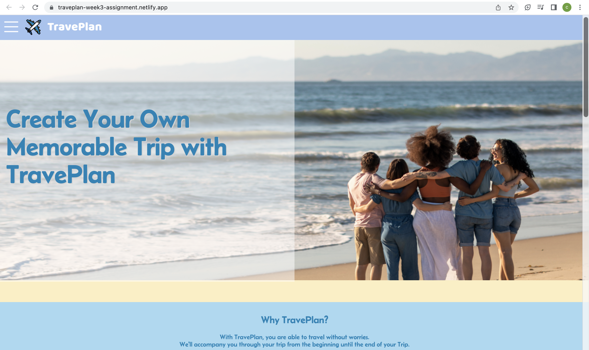

# Welcome to my Repository!

My name is Catherine and right now I'm a student of RevoU Software Engineering program Batch June 2023.

On this week assignment, we were told to improve our week 2 assignment by implementing:
- Custom font using @font-face
- Applying text shadow
- Applying responsive background image and responsive image
- Create asymmetrical grid
- Add advanced form, on this case I use date form
- Create simple animation with 2 method: animation and transition

Here's a sneakpeak of my week 3 assignment website:

You can visit my website by clicking here  
[visit my website](https://traveplan-week3-assignment.netlify.app/) 
or visit my week 2 repository by clicking here 
[visit my week 2 repository](https://github.com/RevoU-FSSE-2/week-2-cathvale) 

Thank you for visiting!